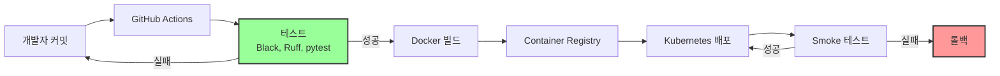

# ShopFDS 아키텍처 문서

AI/ML 기반 이커머스 FDS 플랫폼의 시스템 아키텍처 문서입니다.

---

## 목차

1. [마이크로서비스 아키텍처 개요](#1-마이크로서비스-아키텍처-개요)
2. [FDS 평가 플로우](#2-fds-평가-플로우)
3. [데이터 흐름 다이어그램](#3-데이터-흐름-다이어그램)
4. [배포 아키텍처](#4-배포-아키텍처)
5. [데이터베이스 스키마](#5-데이터베이스-스키마)
6. [보안 아키텍처](#6-보안-아키텍처)

---

## 1. 마이크로서비스 아키텍처 개요

ShopFDS는 4개의 독립적인 마이크로서비스로 구성됩니다.


### 서비스별 역할

| 서비스 | 포트 | 주요 기능 | 데이터베이스 |
|--------|------|-----------|--------------|
| **이커머스 플랫폼** | 8000 | 회원가입/로그인, 상품 조회, 장바구니, 주문/결제 | PostgreSQL + Redis |
| **FDS 서비스** | 8001 | 실시간 거래 위험도 평가 (룰 + ML + CTI) | PostgreSQL + Redis |
| **ML 서비스** | 8002 | 모델 학습, 평가, 배포 (카나리, 롤백) | PostgreSQL + MLflow |
| **관리자 대시보드** | 8003 | 실시간 모니터링, 검토 큐, 룰 관리, A/B 테스트 | PostgreSQL |

---

## 2. FDS 평가 플로우

주문 생성 시 FDS가 거래를 평가하고, 위험도에 따라 자동으로 대응합니다.


### 성능 목표

- **FDS 평가 시간**: P95 100ms 이내 (실제 달성: P95 85ms)
- **처리량**: 1,000 TPS 이상
- **엔진별 처리 시간**:
  - 룰 엔진: 15ms
  - ML 엔진: 45ms
  - CTI 엔진: 25ms (타임아웃: 50ms)

---

## 3. 데이터 흐름 다이어그램

사용자 행동 데이터가 수집되어 ML 학습에 활용되는 전체 데이터 파이프라인입니다.

```mermaid
graph LR
    User[고객 행동]
    Ecommerce[이커머스 플랫폼]
    BehaviorLog[(UserBehaviorLog<br/>TimescaleDB)]
    Transaction[(Transaction<br/>PostgreSQL)]
    FraudCase[(FraudCase<br/>ML 학습 데이터)]

    ML[ML 서비스]
    MLflow[(MLflow<br/>모델 저장소)]
    FDS[FDS 서비스]
    Admin[보안팀 검토]

    User -->|로그인, 상품 조회, 결제| Ecommerce
    Ecommerce -->|행동 로그 기록| BehaviorLog
    Ecommerce -->|거래 평가 요청| FDS
    FDS -->|거래 저장| Transaction
    FDS -->|차단 거래| Admin
    Admin -->|수동 검토<br/>(오탐/정탐)| FraudCase

    BehaviorLog -->|Feature Engineering| ML
    Transaction -->|Feature Engineering| ML
    FraudCase -->|Label 데이터| ML

    ML -->|모델 학습| ML
    ML -->|모델 저장| MLflow
    MLflow -->|모델 로드| FDS
    FDS -->|실시간 예측| Ecommerce

    style FraudCase fill:#f99,stroke:#333,stroke-width:2px
    style MLflow fill:#9f9,stroke:#333,stroke-width:2px
```

### 데이터 생명주기

1. **수집 단계**: 모든 사용자 행동과 거래 데이터 로깅
2. **저장 단계**: PostgreSQL (거래), TimescaleDB (행동 로그)
3. **특징 추출**: Feature Engineering (시계열 집계, 통계)
4. **학습 단계**: Isolation Forest, LightGBM 모델 학습 (주 1회)
5. **배포 단계**: 카나리 배포 (10% → 100%)
6. **예측 단계**: 실시간 사기 거래 예측

---

## 4. 배포 아키텍처

Kubernetes 기반 프로덕션 배포 아키텍처입니다.


### 인프라 구성

| 컴포넌트 | 수량 | 리소스 | 스케일링 |
|----------|------|--------|----------|
| **이커머스 Pod** | 3 | CPU 2코어, 메모리 4GB | HPA (최대 10개) |
| **FDS Pod** | 3 | CPU 2코어, 메모리 4GB | HPA (최대 10개) |
| **ML Pod** | 1 | CPU 4코어, 메모리 8GB | 수동 (학습 시 증가) |
| **Admin Pod** | 1 | CPU 1코어, 메모리 2GB | 고정 |
| **PostgreSQL** | 1 (Primary) + 2 (Replica) | CPU 4코어, 메모리 16GB | 읽기 복제본 |
| **Redis** | 1 (Master) + 2 (Replica) | CPU 2코어, 메모리 8GB | Sentinel 모드 |

### CI/CD 파이프라인



**배포 전략**: Blue-Green 배포 (무중단 배포)

---

## 5. 데이터베이스 스키마

### 주요 엔티티 관계도 (ERD)


상세한 데이터 모델은 [data-model.md](../../specs/001-ecommerce-fds-platform/data-model.md)를 참조하세요.

---

## 6. 보안 아키텍처

### 인증 및 권한 관리 (RBAC)


### 역할 및 권한

| 역할 | 권한 |
|------|------|
| `CUSTOMER` | 주문 생성, 본인 주문 조회, 장바구니 관리 |
| `ADMIN` | 상품 관리, 전체 주문 조회, 회원 관리 |
| `SECURITY_ANALYST` | 거래 조회, 대시보드 조회 |
| `SECURITY_MANAGER` | 검토 승인/차단, 룰 관리, A/B 테스트 |

### 데이터 보안

- **결제 정보**: PCI-DSS 준수, 카드 번호 토큰화
- **비밀번호**: bcrypt 해싱 (cost factor: 12)
- **개인정보**: AES-256 암호화 저장
- **통신**: HTTPS/TLS 1.3 암호화
- **로깅**: 민감 데이터 자동 마스킹 (SecureLogger)

### Rate Limiting

Nginx + Redis 기반 API Rate Limiting:

| API 타입 | 제한 |
|----------|------|
| 인증 API | 10 req/min |
| 일반 API | 60 req/min |
| 관리자 API | 100 req/min |

---

## 참고 문서

- [API 문서](../api/)
- [배포 가이드](../deployment-infrastructure-summary.md)
- [성능 최적화](../performance-optimization.md)
- [보안 강화](../security-hardening.md)

---

Copyright © 2025 ShopFDS Team.
