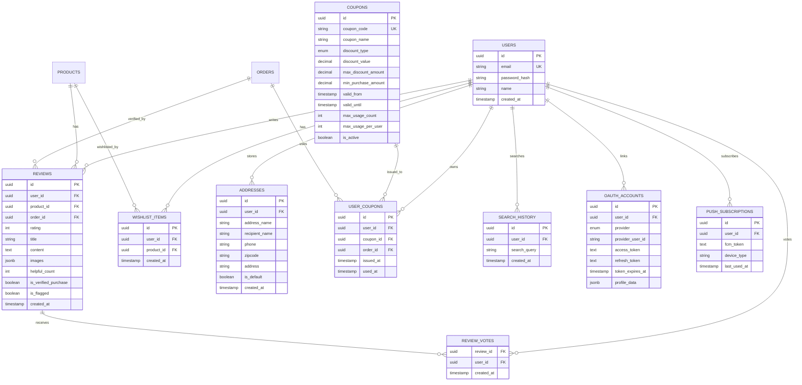

# 데이터 모델: 이커머스 프론트엔드 고도화

**Feature**: 004-frontend-ux-enhancement
**작성일**: 2025-11-19
**상태**: 완료

## 개요

본 문서는 프론트엔드 UX 고도화 기능을 위한 데이터베이스 스키마, 엔티티 관계, 비즈니스 규칙을 정의합니다.

**신규 엔티티**:
1. **Reviews** (리뷰): 상품 리뷰 (별점, 텍스트, 사진)
2. **ReviewVotes** (리뷰 투표): "도움돼요" 투표 중복 방지
3. **WishlistItems** (위시리스트): 찜한 상품
4. **Addresses** (배송지): 여러 배송지 저장
5. **Coupons** (쿠폰): 할인 쿠폰
6. **UserCoupons** (사용자 쿠폰): 사용자별 쿠폰 보유 현황
7. **SearchHistory** (검색 이력): 최근 검색어 (프론트엔드 LocalStorage + 선택적 백엔드 저장)
8. **OAuthAccounts** (OAuth 계정): 소셜 로그인 연동
9. **PushSubscriptions** (푸시 구독): PWA 푸시 알림 구독 정보

---

## 1. Reviews (리뷰)

**설명**: 사용자가 구매한 상품에 대한 리뷰 (별점, 텍스트, 사진)

**비즈니스 규칙**:
- 사용자당 상품당 하나의 리뷰만 작성 가능 (UNIQUE 제약)
- 구매 확정 고객만 리뷰 작성 가능 (`is_verified_purchase`)
- 사진 최대 3장까지 업로드 (JSONB 배열)
- 부적절한 리뷰는 관리자가 신고 처리 (`is_flagged`)

**스키마**:
```sql
CREATE TABLE reviews (
    id UUID PRIMARY KEY DEFAULT gen_random_uuid(),
    user_id UUID NOT NULL REFERENCES users(id) ON DELETE CASCADE,
    product_id UUID NOT NULL REFERENCES products(id) ON DELETE CASCADE,
    order_id UUID REFERENCES orders(id) ON DELETE SET NULL,
    rating INT NOT NULL CHECK (rating BETWEEN 1 AND 5),
    title VARCHAR(200),
    content TEXT NOT NULL CHECK (LENGTH(content) >= 10),
    images JSONB DEFAULT '[]'::jsonb,  -- ["https://cdn.../img1.jpg", ...]
    helpful_count INT DEFAULT 0 CHECK (helpful_count >= 0),
    is_verified_purchase BOOLEAN DEFAULT FALSE,
    is_flagged BOOLEAN DEFAULT FALSE,
    flagged_reason VARCHAR(500),
    created_at TIMESTAMPTZ DEFAULT NOW(),
    updated_at TIMESTAMPTZ DEFAULT NOW(),
    UNIQUE(user_id, product_id),
    CHECK (jsonb_array_length(images) <= 3)
);

CREATE INDEX idx_reviews_product_created ON reviews(product_id, created_at DESC);
CREATE INDEX idx_reviews_product_rating ON reviews(product_id, rating DESC);
CREATE INDEX idx_reviews_product_helpful ON reviews(product_id, helpful_count DESC);
CREATE INDEX idx_reviews_user ON reviews(user_id);
CREATE INDEX idx_reviews_flagged ON reviews(is_flagged) WHERE is_flagged = TRUE;
```

**필드 설명**:
- `order_id`: 구매 주문 ID (검증용, 주문 삭제 시 NULL)
- `rating`: 별점 (1-5점)
- `title`: 리뷰 제목 (선택사항)
- `content`: 리뷰 내용 (최소 10자)
- `images`: 사진 URL 배열 (최대 3장)
- `helpful_count`: "도움돼요" 투표 수
- `is_verified_purchase`: 구매 확정 고객 여부
- `is_flagged`: 신고 처리 여부

---

## 2. ReviewVotes (리뷰 투표)

**설명**: 사용자가 리뷰에 "도움돼요" 투표한 이력 (중복 방지)

**비즈니스 규칙**:
- 사용자당 리뷰당 한 번만 투표 가능 (PRIMARY KEY)
- 투표 시 `reviews.helpful_count` 증가

**스키마**:
```sql
CREATE TABLE review_votes (
    review_id UUID NOT NULL REFERENCES reviews(id) ON DELETE CASCADE,
    user_id UUID NOT NULL REFERENCES users(id) ON DELETE CASCADE,
    created_at TIMESTAMPTZ DEFAULT NOW(),
    PRIMARY KEY (review_id, user_id)
);

CREATE INDEX idx_review_votes_user ON review_votes(user_id);
```

**필드 설명**:
- `review_id`: 투표한 리뷰 ID
- `user_id`: 투표한 사용자 ID

---

## 3. WishlistItems (위시리스트)

**설명**: 사용자가 찜한 상품 목록

**비즈니스 규칙**:
- 로그인 사용자만 위시리스트 사용 가능
- 동일 상품 중복 추가 불가 (UNIQUE 제약)
- 상품 삭제 시 위시리스트에서도 자동 삭제 (CASCADE)

**스키마**:
```sql
CREATE TABLE wishlist_items (
    id UUID PRIMARY KEY DEFAULT gen_random_uuid(),
    user_id UUID NOT NULL REFERENCES users(id) ON DELETE CASCADE,
    product_id UUID NOT NULL REFERENCES products(id) ON DELETE CASCADE,
    created_at TIMESTAMPTZ DEFAULT NOW(),
    UNIQUE(user_id, product_id)
);

CREATE INDEX idx_wishlist_user ON wishlist_items(user_id, created_at DESC);
CREATE INDEX idx_wishlist_product ON wishlist_items(product_id);
```

**필드 설명**:
- `user_id`: 사용자 ID
- `product_id`: 찜한 상품 ID
- `created_at`: 찜한 날짜 (최신순 정렬용)

---

## 4. Addresses (배송지)

**설명**: 사용자의 여러 배송지 주소 저장

**비즈니스 규칙**:
- 사용자당 여러 배송지 저장 가능
- 기본 배송지는 하나만 설정 가능 (애플리케이션 레벨 검증)
- 주문 시 기본 배송지가 자동 선택

**스키마**:
```sql
CREATE TABLE addresses (
    id UUID PRIMARY KEY DEFAULT gen_random_uuid(),
    user_id UUID NOT NULL REFERENCES users(id) ON DELETE CASCADE,
    address_name VARCHAR(100) NOT NULL,  -- 예: "집", "회사"
    recipient_name VARCHAR(100) NOT NULL,
    phone VARCHAR(20) NOT NULL,
    zipcode VARCHAR(10) NOT NULL,
    address VARCHAR(500) NOT NULL,
    address_detail VARCHAR(500),
    is_default BOOLEAN DEFAULT FALSE,
    created_at TIMESTAMPTZ DEFAULT NOW(),
    updated_at TIMESTAMPTZ DEFAULT NOW()
);

CREATE INDEX idx_addresses_user ON addresses(user_id, is_default DESC, created_at DESC);

-- Partial Unique Index: 사용자당 하나의 기본 배송지만 허용
CREATE UNIQUE INDEX idx_addresses_user_default ON addresses(user_id) WHERE is_default = TRUE;
```

**필드 설명**:
- `address_name`: 배송지 별칭 (예: "집", "회사")
- `recipient_name`: 수령인 이름
- `phone`: 수령인 전화번호
- `zipcode`: 우편번호
- `address`: 기본 주소
- `address_detail`: 상세 주소 (동/호수 등)
- `is_default`: 기본 배송지 여부

---

## 5. Coupons (쿠폰)

**설명**: 할인 쿠폰 마스터 데이터

**비즈니스 규칙**:
- `coupon_code` 고유 값 (UNIQUE)
- 정액 할인 또는 정률 할인 (`discount_type`)
- 최소 구매 금액 조건 (`min_purchase_amount`)
- 유효 기간 (`valid_from`, `valid_until`)

**스키마**:
```sql
CREATE TYPE discount_type_enum AS ENUM ('FIXED', 'PERCENT');

CREATE TABLE coupons (
    id UUID PRIMARY KEY DEFAULT gen_random_uuid(),
    coupon_code VARCHAR(50) NOT NULL UNIQUE,
    coupon_name VARCHAR(200) NOT NULL,
    description TEXT,
    discount_type discount_type_enum NOT NULL,
    discount_value DECIMAL(10, 2) NOT NULL CHECK (discount_value > 0),
    max_discount_amount DECIMAL(10, 2),  -- 정률 할인 최대 금액 (PERCENT인 경우)
    min_purchase_amount DECIMAL(10, 2) DEFAULT 0,
    valid_from TIMESTAMPTZ NOT NULL,
    valid_until TIMESTAMPTZ NOT NULL,
    max_usage_count INT,  -- 전체 사용 가능 횟수 (NULL = 무제한)
    max_usage_per_user INT DEFAULT 1,  -- 사용자당 사용 가능 횟수
    current_usage_count INT DEFAULT 0,
    is_active BOOLEAN DEFAULT TRUE,
    created_at TIMESTAMPTZ DEFAULT NOW(),
    CHECK (valid_until > valid_from),
    CHECK (discount_type = 'FIXED' OR max_discount_amount IS NOT NULL)
);

CREATE INDEX idx_coupons_code ON coupons(coupon_code) WHERE is_active = TRUE;
CREATE INDEX idx_coupons_valid ON coupons(valid_from, valid_until) WHERE is_active = TRUE;
```

**필드 설명**:
- `coupon_code`: 쿠폰 코드 (예: "WELCOME2025")
- `discount_type`: 할인 유형 (FIXED: 정액, PERCENT: 정률)
- `discount_value`: 할인 금액 (정액) 또는 할인 비율 (정률, 예: 10 = 10%)
- `max_discount_amount`: 정률 할인 최대 금액 (예: 최대 10,000원)
- `min_purchase_amount`: 최소 구매 금액 (예: 50,000원 이상 구매 시)
- `valid_from`, `valid_until`: 유효 기간
- `max_usage_count`: 전체 사용 가능 횟수
- `max_usage_per_user`: 사용자당 사용 가능 횟수
- `current_usage_count`: 현재까지 사용된 횟수

---

## 6. UserCoupons (사용자 쿠폰)

**설명**: 사용자가 보유한 쿠폰 및 사용 이력

**비즈니스 규칙**:
- 사용자가 쿠폰을 받으면 레코드 생성
- `used_at`이 NULL이면 미사용, NOT NULL이면 사용 완료
- 주문 취소 시 쿠폰 복구 (애플리케이션 레벨 처리)

**스키마**:
```sql
CREATE TABLE user_coupons (
    id UUID PRIMARY KEY DEFAULT gen_random_uuid(),
    user_id UUID NOT NULL REFERENCES users(id) ON DELETE CASCADE,
    coupon_id UUID NOT NULL REFERENCES coupons(id) ON DELETE CASCADE,
    order_id UUID REFERENCES orders(id) ON DELETE SET NULL,
    issued_at TIMESTAMPTZ DEFAULT NOW(),
    used_at TIMESTAMPTZ,
    CHECK (used_at IS NULL OR used_at >= issued_at)
);

CREATE INDEX idx_user_coupons_user ON user_coupons(user_id, used_at);
CREATE INDEX idx_user_coupons_coupon ON user_coupons(coupon_id);
CREATE UNIQUE INDEX idx_user_coupons_order ON user_coupons(order_id) WHERE order_id IS NOT NULL;
```

**필드 설명**:
- `user_id`: 사용자 ID
- `coupon_id`: 쿠폰 ID
- `order_id`: 사용한 주문 ID (사용 시에만)
- `issued_at`: 쿠폰 발급 날짜
- `used_at`: 쿠폰 사용 날짜 (NULL = 미사용)

---

## 7. SearchHistory (검색 이력)

**설명**: 사용자의 최근 검색어 (주로 프론트엔드 LocalStorage, 선택적으로 백엔드 저장)

**비즈니스 규칙**:
- 프론트엔드에서 LocalStorage에 최대 10개 저장
- 백엔드 저장은 선택사항 (로그인 사용자 대상 검색 기록 분석용)
- 중복 검색어는 최신 날짜로 업데이트

**스키마** (선택사항):
```sql
CREATE TABLE search_history (
    id UUID PRIMARY KEY DEFAULT gen_random_uuid(),
    user_id UUID REFERENCES users(id) ON DELETE CASCADE,
    search_query VARCHAR(200) NOT NULL,
    created_at TIMESTAMPTZ DEFAULT NOW()
);

CREATE INDEX idx_search_history_user ON search_history(user_id, created_at DESC);
```

**필드 설명**:
- `user_id`: 사용자 ID (로그인 사용자만, 비로그인은 NULL)
- `search_query`: 검색어
- `created_at`: 검색 날짜

**프론트엔드 LocalStorage 구조**:
```typescript
// LocalStorage Key: "search-history"
interface SearchHistory {
  query: string;
  timestamp: number;  // Unix timestamp
}

// 최대 10개 유지, LIFO 방식
const searchHistory: SearchHistory[] = [
  { query: "아이폰 15", timestamp: 1700000000000 },
  { query: "갤럭시 S24", timestamp: 1699999000000 },
  // ...
];
```

---

## 8. OAuthAccounts (OAuth 계정)

**설명**: Google, Kakao, Naver 소셜 로그인 연동 정보

**비즈니스 규칙**:
- 사용자당 여러 OAuth 제공자 연동 가능
- `provider`와 `provider_user_id` 조합이 고유 (UNIQUE)
- Access Token, Refresh Token 암호화 저장 권장

**스키마**:
```sql
CREATE TYPE oauth_provider_enum AS ENUM ('GOOGLE', 'KAKAO', 'NAVER');

CREATE TABLE oauth_accounts (
    id UUID PRIMARY KEY DEFAULT gen_random_uuid(),
    user_id UUID NOT NULL REFERENCES users(id) ON DELETE CASCADE,
    provider oauth_provider_enum NOT NULL,
    provider_user_id VARCHAR(200) NOT NULL,  -- OAuth 제공자의 사용자 ID
    access_token TEXT,
    refresh_token TEXT,
    token_expires_at TIMESTAMPTZ,
    profile_data JSONB,  -- 이름, 이메일, 아바타 등
    created_at TIMESTAMPTZ DEFAULT NOW(),
    updated_at TIMESTAMPTZ DEFAULT NOW(),
    UNIQUE(provider, provider_user_id)
);

CREATE INDEX idx_oauth_accounts_user ON oauth_accounts(user_id);
CREATE INDEX idx_oauth_accounts_provider ON oauth_accounts(provider, provider_user_id);
```

**필드 설명**:
- `user_id`: 연동된 사용자 ID
- `provider`: OAuth 제공자 (GOOGLE, KAKAO, NAVER)
- `provider_user_id`: OAuth 제공자의 사용자 고유 ID (예: Google의 `sub`)
- `access_token`: OAuth Access Token (암호화 저장 권장)
- `refresh_token`: OAuth Refresh Token
- `token_expires_at`: Access Token 만료 시각
- `profile_data`: 제공자로부터 받은 프로필 정보 (JSONB)

**profile_data 예시**:
```json
{
  "email": "user@gmail.com",
  "name": "홍길동",
  "picture": "https://lh3.googleusercontent.com/..."
}
```

---

## 9. PushSubscriptions (푸시 구독)

**설명**: PWA 푸시 알림 구독 정보 (Firebase Cloud Messaging)

**비즈니스 규칙**:
- 사용자가 알림 권한 허용 시 구독 정보 저장
- `fcm_token` 고유 값 (UNIQUE)
- 구독 해지 시 레코드 삭제

**스키마**:
```sql
CREATE TABLE push_subscriptions (
    id UUID PRIMARY KEY DEFAULT gen_random_uuid(),
    user_id UUID NOT NULL REFERENCES users(id) ON DELETE CASCADE,
    fcm_token TEXT NOT NULL UNIQUE,
    device_type VARCHAR(50),  -- 예: "android", "ios", "web"
    user_agent TEXT,
    created_at TIMESTAMPTZ DEFAULT NOW(),
    last_used_at TIMESTAMPTZ DEFAULT NOW()
);

CREATE INDEX idx_push_subscriptions_user ON push_subscriptions(user_id);
CREATE INDEX idx_push_subscriptions_token ON push_subscriptions(fcm_token);
```

**필드 설명**:
- `user_id`: 사용자 ID
- `fcm_token`: Firebase Cloud Messaging 토큰
- `device_type`: 기기 유형 (android, ios, web)
- `user_agent`: 브라우저 User Agent
- `last_used_at`: 마지막 푸시 알림 전송 시각

---

## 엔티티 관계 다이어그램 (ERD)



---

## 데이터 마이그레이션 계획

### 기존 테이블 수정

**1. users 테이블**:
- 변경 없음 (기존 스키마 유지)

**2. products 테이블**:
- 기존 `image_url` 필드를 `images JSONB` 배열로 변경 (여러 이미지 지원)
- 마이그레이션:
  ```sql
  ALTER TABLE products ADD COLUMN images JSONB DEFAULT '[]'::jsonb;
  UPDATE products SET images = jsonb_build_array(image_url) WHERE image_url IS NOT NULL;
  -- 기존 image_url 컬럼 유지 (하위 호환성)
  ```

**3. orders 테이블**:
- `coupon_id UUID` 필드 추가
  ```sql
  ALTER TABLE orders ADD COLUMN coupon_id UUID REFERENCES coupons(id) ON DELETE SET NULL;
  ALTER TABLE orders ADD COLUMN discount_amount DECIMAL(10, 2) DEFAULT 0;
  ```

### 신규 테이블 생성 순서

1. `coupons` (독립 테이블)
2. `reviews`
3. `review_votes`
4. `wishlist_items`
5. `addresses`
6. `user_coupons`
7. `search_history` (선택)
8. `oauth_accounts`
9. `push_subscriptions`

### Alembic 마이그레이션

```bash
cd services/ecommerce/backend
alembic revision --autogenerate -m "Add frontend UX tables (reviews, wishlist, coupons, etc)"
alembic upgrade head
```

---

## 비즈니스 로직 검증 규칙

### 1. 리뷰 작성 검증
```python
def can_write_review(user_id: UUID, product_id: UUID) -> bool:
    # 1. 구매 확정 주문 존재 여부
    order = db.query(Order).filter(
        Order.user_id == user_id,
        Order.status == OrderStatus.DELIVERED,
        Order.items.any(product_id=product_id)
    ).first()

    if not order:
        return False

    # 2. 이미 리뷰 작성했는지 확인
    existing_review = db.query(Review).filter(
        Review.user_id == user_id,
        Review.product_id == product_id
    ).first()

    return existing_review is None
```

### 2. 쿠폰 사용 검증
```python
def can_use_coupon(user_id: UUID, coupon_code: str, order_amount: Decimal) -> tuple[bool, str]:
    coupon = db.query(Coupon).filter(Coupon.coupon_code == coupon_code).first()

    if not coupon:
        return False, "존재하지 않는 쿠폰입니다"

    if not coupon.is_active:
        return False, "사용할 수 없는 쿠폰입니다"

    now = datetime.now(timezone.utc)
    if not (coupon.valid_from <= now <= coupon.valid_until):
        return False, "유효 기간이 지났습니다"

    if coupon.max_usage_count and coupon.current_usage_count >= coupon.max_usage_count:
        return False, "쿠폰 사용 횟수가 초과되었습니다"

    if order_amount < coupon.min_purchase_amount:
        return False, f"최소 구매 금액 {coupon.min_purchase_amount}원 이상이어야 합니다"

    # 사용자별 사용 횟수 확인
    user_usage_count = db.query(UserCoupon).filter(
        UserCoupon.user_id == user_id,
        UserCoupon.coupon_id == coupon.id,
        UserCoupon.used_at.isnot(None)
    ).count()

    if user_usage_count >= coupon.max_usage_per_user:
        return False, "이미 사용한 쿠폰입니다"

    return True, ""
```

### 3. 기본 배송지 변경
```python
def set_default_address(user_id: UUID, address_id: UUID):
    # 기존 기본 배송지 해제
    db.query(Address).filter(
        Address.user_id == user_id,
        Address.is_default == True
    ).update({"is_default": False})

    # 새 기본 배송지 설정
    db.query(Address).filter(Address.id == address_id).update({"is_default": True})
    db.commit()
```

---

## 인덱스 최적화 전략

### 복합 인덱스
1. **reviews**: `(product_id, created_at DESC)` - 상품별 최신 리뷰 조회
2. **reviews**: `(product_id, rating DESC)` - 상품별 평점 높은순 조회
3. **reviews**: `(product_id, helpful_count DESC)` - 상품별 도움돼요 순 조회
4. **addresses**: `(user_id, is_default DESC, created_at DESC)` - 사용자 배송지 조회 (기본 배송지 우선)

### Partial 인덱스
1. **coupons**: `(coupon_code) WHERE is_active = TRUE` - 활성 쿠폰만 검색
2. **reviews**: `(is_flagged) WHERE is_flagged = TRUE` - 신고된 리뷰만 검색
3. **addresses**: `(user_id) WHERE is_default = TRUE` - 기본 배송지만 검색

---

## 다음 단계

데이터 모델 정의 완료. Phase 1 계속:
1. **API 계약**: REST 엔드포인트 명세 작성
2. **빠른 시작 가이드**: 로컬 개발 환경 설정 문서
