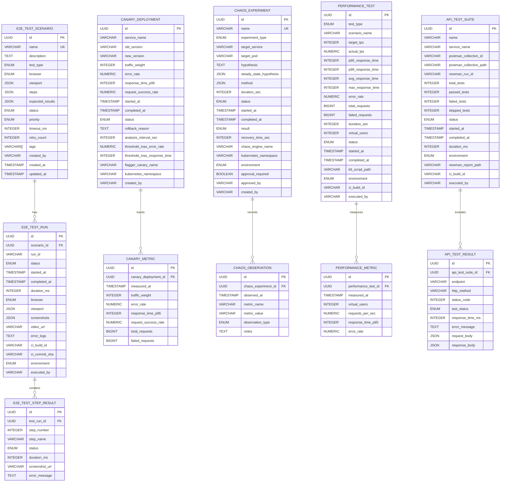

# Data Model: E2E 테스트 자동화 및 시스템 복원력 검증

**Feature Branch**: `005-e2e-testing`
**Created**: 2025-11-20
**Status**: Design

## Overview

E2E 테스트 자동화 및 시스템 복원력 검증 기능을 위한 데이터 모델을 정의한다. 이 모델은 Playwright 기반 E2E 테스트 시나리오, Flagger 카나리 배포 설정, Litmus Chaos 장애 실험, k6 성능 테스트, Newman API 테스트를 관리하며, 테스트 실행 히스토리와 결과를 추적한다. 주요 엔티티는 PostgreSQL에 저장되며, 실시간 메트릭은 Prometheus로 수집된다.

**핵심 목표**:
- E2E 테스트 시나리오 및 실행 결과 관리
- 카나리 배포 상태 및 메트릭 추적
- 장애 실험 히스토리 및 복구 시간 기록
- 성능 테스트 결과 및 임계값 검증
- API 테스트 실행 및 엔드포인트 커버리지 추적

## Entities

### E2E Test Scenario (E2E 테스트 시나리오)

**Purpose**: Playwright로 실행되는 사용자 플로우 테스트 시나리오를 정의하고 관리한다. 각 시나리오는 브라우저, 화면 크기, 테스트 단계, 예상 결과를 포함하며, 여러 테스트 실행 기록과 연결된다.

**Fields**:
| Field | Type | Constraints | Description |
|-------|------|-------------|-------------|
| id | UUID | PRIMARY KEY, NOT NULL | 시나리오 고유 식별자 (자동 생성) |
| name | VARCHAR(255) | UNIQUE, NOT NULL | 시나리오 이름 (예: "회원가입부터 결제까지 전체 플로우") |
| description | TEXT | NULL | 시나리오 상세 설명 |
| test_type | ENUM | NOT NULL | 테스트 유형: 'functional', 'regression', 'smoke', 'integration' |
| browser | ENUM | NOT NULL | 대상 브라우저: 'chromium', 'firefox', 'webkit' |
| viewport | JSON | NOT NULL | 화면 크기 (예: {"width": 1920, "height": 1080}) |
| steps | JSON | NOT NULL | 테스트 단계 배열 (예: [{"action": "click", "selector": "#login-button"}]) |
| expected_results | JSON | NOT NULL | 예상 결과 배열 (예: [{"type": "url", "value": "/dashboard"}]) |
| status | ENUM | NOT NULL, DEFAULT 'active' | 시나리오 상태: 'draft', 'active', 'archived' |
| priority | ENUM | NOT NULL, DEFAULT 'medium' | 우선순위: 'critical', 'high', 'medium', 'low' |
| timeout_ms | INTEGER | NOT NULL, DEFAULT 30000 | 시나리오 타임아웃 (밀리초) |
| retry_count | INTEGER | NOT NULL, DEFAULT 2 | CI 환경에서 재시도 횟수 |
| tags | VARCHAR(255)[] | NULL | 태그 배열 (예: ['checkout', 'payment', 'fds']) |
| created_by | VARCHAR(100) | NOT NULL | 시나리오 작성자 |
| created_at | TIMESTAMP | NOT NULL, DEFAULT NOW() | 생성 시각 |
| updated_at | TIMESTAMP | NOT NULL, DEFAULT NOW() | 최종 수정 시각 |

**Relationships**:
- `test_runs`: E2E Test Run 엔티티와 1:N 관계 (하나의 시나리오는 여러 실행 기록을 가짐)

**Validation Rules**:
- `name`은 시스템 전체에서 고유해야 함
- `browser`는 'chromium', 'firefox', 'webkit' 중 하나여야 함
- `viewport`는 width, height 필드를 포함해야 함 (예: {"width": 1920, "height": 1080})
- `steps` 배열은 최소 1개 이상의 단계를 포함해야 함
- `timeout_ms`는 5000ms 이상 600000ms 이하여야 함
- `retry_count`는 0 이상 5 이하여야 함
- `status`가 'draft'인 시나리오는 CI에서 실행되지 않음

**State Transitions**:
```
draft -> active -> archived
  ^        |
  |--------|  (수정 시 active -> draft 가능)
```

**Indexes**:
- `idx_e2e_scenario_name` (name) - 시나리오 이름 검색
- `idx_e2e_scenario_status` (status) - 활성 시나리오 필터링
- `idx_e2e_scenario_test_type` (test_type) - 테스트 유형별 조회
- `idx_e2e_scenario_tags` (tags) - GIN 인덱스로 태그 검색

---

### E2E Test Run (E2E 테스트 실행 기록)

**Purpose**: E2E 테스트 시나리오의 실행 결과를 기록한다. CI/CD 파이프라인에서 자동 실행되며, 실행 시간, 성공/실패 여부, 스크린샷, 에러 로그를 저장한다.

**Fields**:
| Field | Type | Constraints | Description |
|-------|------|-------------|-------------|
| id | UUID | PRIMARY KEY, NOT NULL | 실행 기록 고유 식별자 |
| scenario_id | UUID | FOREIGN KEY, NOT NULL | E2E Test Scenario 참조 |
| run_id | VARCHAR(100) | NOT NULL | CI 빌드 실행 ID (예: GitHub Actions Run ID) |
| status | ENUM | NOT NULL | 실행 상태: 'pending', 'running', 'passed', 'failed', 'skipped' |
| started_at | TIMESTAMP | NOT NULL | 실행 시작 시각 |
| completed_at | TIMESTAMP | NULL | 실행 완료 시각 |
| duration_ms | INTEGER | NULL | 실행 시간 (밀리초) |
| browser | ENUM | NOT NULL | 실행된 브라우저: 'chromium', 'firefox', 'webkit' |
| viewport | JSON | NOT NULL | 실행 시 화면 크기 |
| screenshots | JSON | NULL | 스크린샷 URL 배열 (예: [{"step": "login", "url": "s3://..."}]) |
| video_url | VARCHAR(500) | NULL | 실행 비디오 녹화 URL (실패 시) |
| error_logs | TEXT | NULL | 에러 메시지 및 스택 트레이스 |
| ci_build_id | VARCHAR(100) | NULL | CI 빌드 ID (GitHub Actions, GitLab CI 등) |
| ci_commit_sha | VARCHAR(40) | NULL | Git 커밋 SHA |
| environment | ENUM | NOT NULL | 실행 환경: 'local', 'staging', 'production' |
| executed_by | VARCHAR(100) | NOT NULL | 실행자 (사용자명 또는 'ci-bot') |

**Relationships**:
- `scenario`: E2E Test Scenario 엔티티와 N:1 관계 (여러 실행 기록이 하나의 시나리오 참조)
- `test_steps`: E2E Test Step Result 엔티티와 1:N 관계 (하나의 실행은 여러 단계 결과를 가짐)

**Validation Rules**:
- `duration_ms`는 0 이상이어야 함
- `status`가 'completed' 또는 'failed'일 때 `completed_at`은 NOT NULL
- `status`가 'failed'일 때 `error_logs`는 NOT NULL
- `started_at`은 `completed_at`보다 이전이어야 함

**State Transitions**:
```
pending -> running -> passed/failed/skipped
```

**Indexes**:
- `idx_e2e_run_scenario_id` (scenario_id) - 시나리오별 실행 기록 조회
- `idx_e2e_run_status` (status) - 실행 상태별 필터링
- `idx_e2e_run_ci_build_id` (ci_build_id) - CI 빌드별 조회
- `idx_e2e_run_started_at` (started_at DESC) - 최근 실행 기록 조회

---

### Canary Deployment (카나리 배포)

**Purpose**: Flagger를 통해 관리되는 카나리 배포의 상태와 메트릭을 추적한다. 트래픽 분할 비율, 에러율, 응답 시간을 모니터링하며, 자동 롤백 조건과 이력을 기록한다.

**Fields**:
| Field | Type | Constraints | Description |
|-------|------|-------------|-------------|
| id | UUID | PRIMARY KEY, NOT NULL | 배포 고유 식별자 |
| service_name | VARCHAR(100) | NOT NULL | 대상 서비스 이름 (예: 'ecommerce-backend', 'fds') |
| old_version | VARCHAR(50) | NOT NULL | 이전 버전 (예: 'v1.0.0') |
| new_version | VARCHAR(50) | NOT NULL | 새 버전 (예: 'v1.1.0') |
| traffic_weight | INTEGER | NOT NULL, DEFAULT 0 | 카나리 버전 트래픽 비율 (0-100) |
| error_rate | NUMERIC(5, 2) | NULL | 현재 에러율 (%) |
| response_time_p95 | INTEGER | NULL | P95 응답 시간 (밀리초) |
| request_success_rate | NUMERIC(5, 2) | NULL | 요청 성공률 (%) |
| started_at | TIMESTAMP | NOT NULL, DEFAULT NOW() | 배포 시작 시각 |
| completed_at | TIMESTAMP | NULL | 배포 완료 시각 |
| status | ENUM | NOT NULL, DEFAULT 'initializing' | 배포 상태: 'initializing', 'progressing', 'succeeded', 'failed', 'rollback' |
| rollback_reason | TEXT | NULL | 롤백 사유 (자동 롤백 시 조건 기록) |
| analysis_interval_sec | INTEGER | NOT NULL, DEFAULT 60 | 메트릭 분석 주기 (초) |
| threshold_max_error_rate | NUMERIC(5, 2) | NOT NULL, DEFAULT 5.0 | 에러율 임계값 (%) |
| threshold_max_response_time | INTEGER | NOT NULL, DEFAULT 200 | 응답 시간 임계값 (밀리초) |
| flagger_canary_name | VARCHAR(100) | NOT NULL | Flagger Canary CRD 이름 |
| kubernetes_namespace | VARCHAR(100) | NOT NULL | Kubernetes Namespace |
| created_by | VARCHAR(100) | NOT NULL | 배포 시작자 |

**Relationships**:
- `metrics`: Canary Metric 엔티티와 1:N 관계 (배포 중 메트릭 스냅샷)

**Validation Rules**:
- `traffic_weight`는 0 이상 100 이하여야 함
- `error_rate`는 0 이상 100 이하여야 함
- `response_time_p95`는 0 이상이어야 함
- `old_version`과 `new_version`은 서로 달라야 함
- `threshold_max_error_rate`는 0 이상 100 이하여야 함
- 버전 형식은 Semantic Versioning 준수 (예: v1.2.3)

**State Transitions**:
```
initializing -> progressing -> succeeded/failed
                    |
                    v
                 rollback
```

**Indexes**:
- `idx_canary_service_name` (service_name) - 서비스별 배포 히스토리
- `idx_canary_status` (status) - 진행 중인 배포 조회
- `idx_canary_started_at` (started_at DESC) - 최근 배포 히스토리
- `idx_canary_new_version` (new_version) - 버전별 배포 조회

---

### Chaos Experiment (장애 실험)

**Purpose**: Litmus Chaos를 통해 실행되는 장애 시뮬레이션 실험을 관리한다. Pod 종료, 네트워크 지연, 리소스 부족 등의 장애 시나리오를 정의하고, 실험 결과와 복구 시간을 기록한다.

**Fields**:
| Field | Type | Constraints | Description |
|-------|------|-------------|-------------|
| id | UUID | PRIMARY KEY, NOT NULL | 실험 고유 식별자 |
| name | VARCHAR(255) | UNIQUE, NOT NULL | 실험 이름 (예: "FDS Pod 무작위 종료 복원력 테스트") |
| experiment_type | ENUM | NOT NULL | 실험 유형: 'pod_delete', 'network_latency', 'network_loss', 'cpu_stress', 'memory_stress', 'disk_stress' |
| target_service | VARCHAR(100) | NOT NULL | 대상 서비스 (예: 'fds-backend', 'ecommerce-backend') |
| target_pod | VARCHAR(100) | NULL | 대상 Pod 이름 (특정 Pod 지정 시) |
| hypothesis | TEXT | NOT NULL | 가설 (예: "FDS Pod 종료 시 30초 이내 자동 복구됨") |
| steady_state_hypothesis | JSON | NOT NULL | 정상 상태 가설 (예: {"error_rate": "<5%", "response_time_p95": "<200ms"}) |
| method | JSON | NOT NULL | 실험 방법 (예: {"chaos_interval": "10s", "total_duration": "60s"}) |
| duration_sec | INTEGER | NOT NULL | 실험 지속 시간 (초) |
| status | ENUM | NOT NULL, DEFAULT 'scheduled' | 실험 상태: 'scheduled', 'running', 'completed', 'stopped', 'failed' |
| started_at | TIMESTAMP | NULL | 실험 시작 시각 |
| completed_at | TIMESTAMP | NULL | 실험 완료 시각 |
| result | ENUM | NULL | 실험 결과: 'passed', 'failed' |
| recovery_time_sec | INTEGER | NULL | 복구 소요 시간 (초) |
| chaos_engine_name | VARCHAR(100) | NOT NULL | Litmus ChaosEngine CRD 이름 |
| kubernetes_namespace | VARCHAR(100) | NOT NULL | Kubernetes Namespace |
| environment | ENUM | NOT NULL, DEFAULT 'staging' | 실행 환경: 'staging', 'production' |
| approval_required | BOOLEAN | NOT NULL, DEFAULT TRUE | 수동 승인 필요 여부 (프로덕션 환경) |
| approved_by | VARCHAR(100) | NULL | 승인자 (프로덕션 환경) |
| created_by | VARCHAR(100) | NOT NULL | 실험 생성자 |

**Relationships**:
- `observations`: Chaos Observation 엔티티와 1:N 관계 (실험 중 관찰 기록)

**Validation Rules**:
- `experiment_type`은 'pod_delete', 'network_latency', 'network_loss', 'cpu_stress', 'memory_stress', 'disk_stress' 중 하나여야 함
- `duration_sec`는 10초 이상 600초 이하여야 함 (안전 장치)
- `environment`가 'production'일 때 `approval_required`는 TRUE여야 함
- `status`가 'running'일 때 `started_at`은 NOT NULL
- `status`가 'completed' 또는 'stopped'일 때 `completed_at`은 NOT NULL
- `result`가 'passed'일 때 `recovery_time_sec`는 30초 이하여야 함 (목표)

**State Transitions**:
```
scheduled -> running -> completed/stopped/failed
                |
                v
            (result: passed/failed)
```

**Indexes**:
- `idx_chaos_target_service` (target_service) - 서비스별 실험 조회
- `idx_chaos_status` (status) - 진행 중인 실험 조회
- `idx_chaos_experiment_type` (experiment_type) - 실험 유형별 조회
- `idx_chaos_started_at` (started_at DESC) - 최근 실험 히스토리

---

### Performance Test (성능 테스트)

**Purpose**: k6를 통해 실행되는 부하 테스트 결과를 관리한다. Spike Test, Soak Test, Stress Test 등 다양한 테스트 시나리오의 처리량, 응답 시간, 에러율을 기록한다.

**Fields**:
| Field | Type | Constraints | Description |
|-------|------|-------------|-------------|
| id | UUID | PRIMARY KEY, NOT NULL | 테스트 고유 식별자 |
| test_type | ENUM | NOT NULL | 테스트 유형: 'spike', 'soak', 'stress', 'load' |
| scenario_name | VARCHAR(255) | NOT NULL | 시나리오 이름 (예: "블랙 프라이데이 시뮬레이션") |
| target_tps | INTEGER | NOT NULL | 목표 TPS (Transactions Per Second) |
| actual_tps | NUMERIC(10, 2) | NULL | 실제 달성 TPS |
| p95_response_time | INTEGER | NULL | P95 응답 시간 (밀리초) |
| p99_response_time | INTEGER | NULL | P99 응답 시간 (밀리초) |
| avg_response_time | INTEGER | NULL | 평균 응답 시간 (밀리초) |
| max_response_time | INTEGER | NULL | 최대 응답 시간 (밀리초) |
| error_rate | NUMERIC(5, 2) | NULL | 에러율 (%) |
| total_requests | BIGINT | NULL | 총 요청 수 |
| failed_requests | BIGINT | NULL | 실패한 요청 수 |
| duration_sec | INTEGER | NOT NULL | 테스트 지속 시간 (초) |
| virtual_users | INTEGER | NOT NULL | 가상 사용자 수 (VU) |
| status | ENUM | NOT NULL | 테스트 상태: 'pending', 'running', 'completed', 'failed' |
| started_at | TIMESTAMP | NULL | 테스트 시작 시각 |
| completed_at | TIMESTAMP | NULL | 테스트 완료 시각 |
| k6_script_path | VARCHAR(500) | NOT NULL | k6 스크립트 파일 경로 |
| environment | ENUM | NOT NULL | 실행 환경: 'staging', 'production' |
| ci_build_id | VARCHAR(100) | NULL | CI 빌드 ID (자동 실행 시) |
| executed_by | VARCHAR(100) | NOT NULL | 실행자 |

**Relationships**:
- `metrics`: Performance Metric 엔티티와 1:N 관계 (시간별 메트릭 스냅샷)

**Validation Rules**:
- `test_type`은 'spike', 'soak', 'stress', 'load' 중 하나여야 함
- `target_tps`는 1 이상이어야 함
- `error_rate`는 0 이상 100 이하여야 함
- `duration_sec`는 10초 이상이어야 함
- `virtual_users`는 1 이상이어야 함
- `p95_response_time`은 `p99_response_time`보다 작거나 같아야 함

**State Transitions**:
```
pending -> running -> completed/failed
```

**Indexes**:
- `idx_perf_test_type` (test_type) - 테스트 유형별 조회
- `idx_perf_scenario_name` (scenario_name) - 시나리오별 히스토리
- `idx_perf_started_at` (started_at DESC) - 최근 테스트 히스토리
- `idx_perf_status` (status) - 진행 중인 테스트 조회

---

### API Test Suite (API 테스트 슈트)

**Purpose**: Newman을 통해 실행되는 Postman 컬렉션 기반 API 테스트 결과를 관리한다. 서비스 간 통합 테스트와 엔드포인트 커버리지를 추적한다.

**Fields**:
| Field | Type | Constraints | Description |
|-------|------|-------------|-------------|
| id | UUID | PRIMARY KEY, NOT NULL | 테스트 슈트 고유 식별자 |
| name | VARCHAR(255) | NOT NULL | 테스트 슈트 이름 (예: "Ecommerce API 통합 테스트") |
| service_name | VARCHAR(100) | NOT NULL | 대상 서비스 (예: 'ecommerce-backend', 'fds', 'ml-service') |
| postman_collection_id | VARCHAR(100) | NOT NULL | Postman 컬렉션 ID |
| postman_collection_path | VARCHAR(500) | NOT NULL | Postman 컬렉션 JSON 파일 경로 |
| newman_run_id | VARCHAR(100) | NULL | Newman 실행 ID |
| total_tests | INTEGER | NULL | 총 테스트 수 |
| passed_tests | INTEGER | NULL | 통과한 테스트 수 |
| failed_tests | INTEGER | NULL | 실패한 테스트 수 |
| skipped_tests | INTEGER | NULL | 건너뛴 테스트 수 |
| status | ENUM | NOT NULL | 실행 상태: 'pending', 'running', 'completed', 'failed' |
| started_at | TIMESTAMP | NULL | 실행 시작 시각 |
| completed_at | TIMESTAMP | NULL | 실행 완료 시각 |
| duration_ms | INTEGER | NULL | 실행 시간 (밀리초) |
| environment | ENUM | NOT NULL | 실행 환경: 'local', 'staging', 'production' |
| newman_report_path | VARCHAR(500) | NULL | Newman HTML 리포트 경로 |
| ci_build_id | VARCHAR(100) | NULL | CI 빌드 ID |
| executed_by | VARCHAR(100) | NOT NULL | 실행자 |

**Relationships**:
- `test_results`: API Test Result 엔티티와 1:N 관계 (각 API 테스트 결과)

**Validation Rules**:
- `total_tests`는 0 이상이어야 함
- `passed_tests + failed_tests + skipped_tests = total_tests`
- `duration_ms`는 0 이상이어야 함
- `status`가 'completed' 또는 'failed'일 때 `completed_at`은 NOT NULL

**State Transitions**:
```
pending -> running -> completed/failed
```

**Indexes**:
- `idx_api_suite_service_name` (service_name) - 서비스별 테스트 조회
- `idx_api_suite_status` (status) - 진행 중인 테스트 조회
- `idx_api_suite_started_at` (started_at DESC) - 최근 테스트 히스토리

---

## Entity Relationship Diagram



## Storage Strategy

### PostgreSQL (주 데이터베이스)

**테이블 저장**:
- `e2e_test_scenarios`: E2E 테스트 시나리오 정의
- `e2e_test_runs`: E2E 테스트 실행 기록
- `e2e_test_step_results`: E2E 테스트 단계별 결과
- `canary_deployments`: 카나리 배포 상태
- `canary_metrics`: 카나리 배포 메트릭 스냅샷
- `chaos_experiments`: 장애 실험 정의 및 결과
- `chaos_observations`: 장애 실험 중 관찰 기록
- `performance_tests`: 성능 테스트 결과
- `performance_metrics`: 성능 테스트 메트릭 스냅샷
- `api_test_suites`: API 테스트 슈트 실행 기록
- `api_test_results`: API 테스트 상세 결과

**보관 정책**:
- E2E 테스트 실행 기록: 최근 90일 (이후 아카이브)
- 카나리 배포 히스토리: 최근 180일
- 장애 실험 결과: 최근 365일
- 성능 테스트 결과: 최근 180일
- API 테스트 결과: 최근 90일

**파티셔닝 전략**:
- `e2e_test_runs`: `started_at` 컬럼 기준 월별 파티셔닝
- `performance_tests`: `started_at` 컬럼 기준 월별 파티셔닝

### Prometheus (시계열 메트릭)

**메트릭 저장**:
- `e2e_test_duration_seconds`: E2E 테스트 실행 시간
- `e2e_test_success_rate`: E2E 테스트 성공률
- `canary_traffic_weight`: 카나리 트래픽 비율
- `canary_error_rate`: 카나리 에러율
- `canary_response_time_p95`: 카나리 P95 응답 시간
- `chaos_recovery_time_seconds`: 장애 복구 시간
- `performance_test_tps`: 성능 테스트 TPS
- `performance_test_response_time_p95`: 성능 테스트 P95 응답 시간
- `api_test_success_rate`: API 테스트 성공률

**보관 기간**: 30일 (Prometheus 기본 설정)

### S3 / Object Storage (파일 저장)

**저장 파일**:
- E2E 테스트 스크린샷: `s3://shopfds-e2e-tests/screenshots/{run_id}/{step}.png`
- E2E 테스트 비디오: `s3://shopfds-e2e-tests/videos/{run_id}.mp4`
- Newman HTML 리포트: `s3://shopfds-api-tests/reports/{suite_id}.html`
- k6 성능 테스트 리포트: `s3://shopfds-performance-tests/reports/{test_id}.html`

**보관 정책**: 30일 후 Glacier로 이동, 90일 후 삭제

### Kubernetes CRDs (Custom Resources)

**Litmus Chaos CRDs**:
- ChaosEngine: 장애 실험 정의
- ChaosResult: 실험 결과 (PostgreSQL로 동기화)

**Flagger CRDs**:
- Canary: 카나리 배포 설정
- MetricTemplate: 메트릭 분석 템플릿

### Redis (임시 캐시)

**캐시 데이터**:
- 진행 중인 카나리 배포 상태: `canary:deployment:{service_name}` (TTL: 1시간)
- 진행 중인 장애 실험 상태: `chaos:experiment:{id}` (TTL: 1시간)
- E2E 테스트 실행 상태: `e2e:run:{run_id}` (TTL: 30분)

## Data Access Patterns

### E2E 테스트 조회

**최근 실행 기록 조회**:
```sql
SELECT r.*, s.name, s.test_type
FROM e2e_test_runs r
JOIN e2e_test_scenarios s ON r.scenario_id = s.id
WHERE s.status = 'active'
ORDER BY r.started_at DESC
LIMIT 20;
```

**실패한 테스트 조회**:
```sql
SELECT s.name, COUNT(*) as failure_count
FROM e2e_test_runs r
JOIN e2e_test_scenarios s ON r.scenario_id = s.id
WHERE r.status = 'failed'
  AND r.started_at >= NOW() - INTERVAL '7 days'
GROUP BY s.name
ORDER BY failure_count DESC;
```

### 카나리 배포 모니터링

**진행 중인 배포 조회**:
```sql
SELECT * FROM canary_deployments
WHERE status IN ('initializing', 'progressing')
ORDER BY started_at DESC;
```

**배포 메트릭 추이**:
```sql
SELECT measured_at, traffic_weight, error_rate, response_time_p95
FROM canary_metrics
WHERE canary_deployment_id = :deployment_id
ORDER BY measured_at ASC;
```

### 장애 실험 분석

**복구 시간 통계**:
```sql
SELECT experiment_type,
       AVG(recovery_time_sec) as avg_recovery_time,
       MAX(recovery_time_sec) as max_recovery_time,
       COUNT(*) as total_experiments
FROM chaos_experiments
WHERE result = 'passed'
  AND started_at >= NOW() - INTERVAL '30 days'
GROUP BY experiment_type;
```

### 성능 테스트 트렌드

**P95 응답 시간 추이**:
```sql
SELECT scenario_name, started_at, p95_response_time
FROM performance_tests
WHERE test_type = 'spike'
  AND status = 'completed'
ORDER BY started_at DESC
LIMIT 10;
```

## Migration Strategy

### Phase 1: 스키마 생성 (Week 1)

```sql
-- Alembic migration 스크립트
CREATE TABLE e2e_test_scenarios (...);
CREATE TABLE e2e_test_runs (...);
CREATE TABLE canary_deployments (...);
CREATE TABLE chaos_experiments (...);
CREATE TABLE performance_tests (...);
CREATE TABLE api_test_suites (...);
```

### Phase 2: 초기 데이터 입력 (Week 2)

- 20개 E2E 테스트 시나리오 정의
- 4개 서비스 카나리 배포 설정
- 5가지 장애 실험 정의

### Phase 3: CI/CD 통합 (Week 3-4)

- GitHub Actions에서 테스트 실행 후 PostgreSQL 기록
- Prometheus 메트릭 수집 통합

## Performance Considerations

**예상 데이터 성장**:
- E2E 테스트 실행: 하루 50회 → 월 1,500개 레코드
- 카나리 배포: 주 10회 → 월 40개 레코드
- 장애 실험: 주 5회 → 월 20개 레코드
- 성능 테스트: 주 7회 → 월 28개 레코드
- API 테스트: 하루 100회 → 월 3,000개 레코드

**월간 총 데이터**: 약 4,588개 레코드 (메타데이터만, 메트릭 스냅샷 제외)

**디스크 사용량 예상**: 월 500MB (PostgreSQL) + 10GB (S3 파일)

**쿼리 성능 목표**:
- 최근 테스트 조회: 100ms 이내
- 배포 히스토리 조회: 200ms 이내
- 메트릭 추이 조회: 300ms 이내

## Security Considerations

**민감 정보 보호**:
- CI 빌드 토큰: 환경 변수로 관리, DB에 저장하지 않음
- Kubernetes 인증 정보: Secret으로 관리
- 프로덕션 환경 장애 실험: RBAC 기반 승인 필수

**접근 제어**:
- E2E 테스트 시나리오: 개발자 읽기/쓰기
- 카나리 배포: DevOps 팀만 승인 권한
- 장애 실험 (프로덕션): SRE 팀만 실행 권한
- 성능 테스트: QA 팀 실행 권한

**감사 로그**:
- 모든 배포/실험 실행 시 `created_by`, `approved_by` 기록
- 롤백 발생 시 `rollback_reason` 필수 기록

---

**마지막 업데이트**: 2025-11-20
**리뷰 필요**: Phase 0 (Research) 완료 후 데이터 모델 최종 검토
